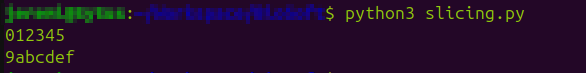
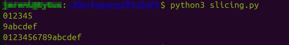
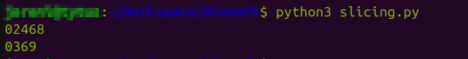
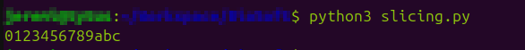

${\color{gray} \small \texttt{Napisał Jeremi Maciejewski}}$
<br/>*[Spis treści kursu](<../README.md#spis-treści>)*

# Typy danych I

Kolejny koncept programistyczny, który omówimy to typy danych.
<br/>Wiesz już, [jak przechowywać dane w zmiennych](<2 Czym sa zmienne.md>), więc czas się dowiedzieć, co konkretnie można w nich przechowywać.

Każda zmienna ma swój typ.
<br/>${\color{lightgray} \tiny \textit{I nie mowa tu o facetach...}}$

Spotkaliśmy się już z dwoma spośród podstawowych typów danych:
- Liczby całkowite (*integer*)
- Tekst (*string*)

Zaczniemy od nich, a następnie przejdziemy do pozostałych typów danych.

## Spis treści
- [Integer](#integer)
- [String](#string)
  - [Metody](#metody)
  - [Slicing](#slicing)
  - [F-string](#fstring)
- [Float](#float)
- [Boolean](#boolean)
- [Konwersja typów](#konwersja-typów)
- [Ćwiczenia](#cwiczenia)

## Integer
### [🠉](#spis-treści)
Jest to typ danych odpowiadający liczbom całkowitym.
<br/>W Pythonie nazywany jest skrótowo `int`.
<br/>Zmienną typu `int` można stworzyć poprzez przypisanie liczby całkowitej lub za pomocą polecenia `int()`

```py
my_number = 12
second_number = int() # Automatycznie otrzyma wartość 0
```

<a name="matematyka"></a>

${\color{blue} \huge \textbf{Matematyka}}$

Na wartościach tego typu można używać *operatorów matematycznych*:
- `+` - dodawanie
- `-` - odejmowanie
- `*` - mnożenie
- `/` - dzielenie
- `//` - dzielenie całkowite (wynik pozbawiony jest części po przecinku, np. `10 / 4` = 2.5, ale `10 // 4` = 2)
- `**` - potęgowanie
- `%` - modulo, czyli reszta z dzielenia (np. `5 / 3` = 1 r.2, zatem `5 % 3` = 2)

Nie ma *operatora*, który umożliwia pierwiastkowanie, ale istnieje na to sprytny sposób:

```py
square_root_of_2 = 2 ** (1/2)
```

Przy okazji użyłem też operatorów otwarcia i zamknięcia nawiasu, których działanie, jak sądzę, jest oczywiste.

> Przypomnienie ze szkoły na wszelki wypadek: ${\Large \sqrt[y]{x} = x^{\frac{1}{y}}}$ zatem ${\Large \sqrt[2]{2} = 2^{\frac{1}{2}}}$

## String
### [🠉](#spis-treści)
Typ danych służący do przechowywania tekstu.
<br/>Nazwa 'string' oznacza dosłownie sznurek. Bierze się ona z tego, że każdy string jest *łańcuchem znaków* (tudzież "sznurkiem znaków" jeśli wolisz 😉).
<br/>Znak jest to pojedyncza litera, cyfra itp.

<br/>W Pythonie string jest zwykle nazywany skrótowo `str`.
<br/>Wartość tego typu można stworzyć poprzez przypisanie tekstu otoczonego cudzysłowem, (pojedynczym lub podwójnym, nie ma to znaczenia. O ile jesteśmy konsekwentni) lub za pomocą polecenia `str()`.

```py
hello = "Cześć!"
empty = str() # Pusty napis
```

Można również stworzyć string wielolinijkowy, o którym wspomniałem już w poprzednim temacie:

```
long = '''Ten tekst
jest trochę zbyt długi,
więc podzieliłem go na
kilka linijek.'''
```

Dane typu string można konkatenować (łączyć, *concatenate*) za pomocą operatora `+`:

```py
a = "Hello"
b = " World!"

print(a + b)
```

`Hello World!`

String można również powielić za pomocą operatora `*`:

```py
a = "Hello"
b = a * 3

print(b)
```

`HelloHelloHello`

<br/>Warto jeszcze zaznaczyć, że dane typu string są *niemutowalne*, czyli niezmienne.
<br/>W praktyce oznacza to, że nie da się ich zmodyfikować - jeśli chcemy np. zmienić jedną literę w jakimś napisie, to musimy cały wyrzucić i zastąpić nowym, ze zmienioną literą.

W poniższych podrozdziałach opiszę cały szereg możliwości, które udostępnia nam string.
<br/>

<a name="metody"></a>

${\color{blue} \huge \textbf{Metody}}$

Dane typu string posiadają cały zestaw metod, czyli specjalnych poleceń, które służą głównie do stworzenia nowego tekstu na podstawie tego, na którym używamy polecenia.
<br/>W związku z niemutowalnością danych typu string, musimy pamiętać, że zawartość zmiennej nie zmieni się sama.
<br/>A więc po użyciu takiej metody zwykle chcemy przypisać wynik jej działania do nowej zmiennej (albo i tej samej, zastępując w ten sposób oryginał).

```py
text = "mój napis"
TEXT = text.upper()

print(text)
print(TEXT)
```

`mój napis`
<br/>`MÓJ NAPIS`

Użyłem właśnie metody `upper()`, która na podstawie napisu zawartego w zmiennej `text`, stworzyła nowy, zapisany wielkimi literami.
<br/>Zauważ, że zmienna `text` nie zmieniła swojej zawartości. Wynik działania metody musiałem zapisać w zmiennej `TEXT`.
<br/>Co prawda, jeśli nie byłby mi już potrzebny oryginalny napis, mógłbym zrobić tak:

```py
text = "mój napis"
text = text.upper()

print(text)
```

`MÓJ NAPIS`

Kilka bardziej użytecznych metod, których można użyć na danych typu string znajdziecie poniżej:
- `upper()` - zmienia wszystkie litery na wielkie
- `lower()` - zmienia wszystkie litery na małe
- `capitalize()` - zmienia pierwszą literę na wielką, np. `"ania ma kota".capitalize()` = `"Ania ma kota"`
- `title()` - zmienia pierwszą literę **każdego słowa** na wielką, np. `"ania ma kota".title()` = `"Ania Ma Kota"`
- `replace(x, y)` - zmienia wszystkie wystąpienia litery/słowa `x` na `y`, np. `"ania ma kota".replace('a', '*')` = `"*ni* m* kot*"`
- `count(x)` - zwraca liczbę wystąpień litery/słowa `x`, np. `"ania ma kota".count('a')` = `4`

Takich metod istnieje znacznie więcej. Po kompletną listę odsyłam do [dokumentacji Pythona](https://docs.python.org/3/library/stdtypes.html#string-methods) - choć na razie pewnie ci się nie przyda.

<a name="slicing"></a>

${\color{blue} \huge \textbf{Slicing}}$

*Slicing* (ang. dosł. kroić) to technika pozwalająca nam "wyciąć" z dłuższego tekstu jakiś jego fragment.
<br/>W tym celu wykorzystuje się operator nawiasów kwadratowych.

Trzeba tu wspomnieć, że każdy znak w string-u - łańcuchu znaków - ma przypisany swój numer, nazywany indeksem (*index*).
<br/>W języku Python pierwszy znak ma zawsze indeks 0.
<br/>Slicing odbywa się poprzez umieszczenie indeksów pierwszego oraz ostatniego znaku we fragmencie, który chcemy wyciąć, wewnątrz operatora nawiasów kwadratowych - oddzielonych dwukropkiem.

```py
chain = "0123456789abcdef"
part1 = chain[0:6]
part2 = chain[9:16]

print(part1)
print(part2)
```

**

Ale zaraz. Czy aby pierwszy fragment nie miał obejmować cyfr od 0 do 6?
<br/>Okazuje się, że dla Pythona "od 0 do 6" oznacza wszystko pomiędzy 0 a 6, ale z wyłączeniem samego 6.
<br/>Trzeba o tym pamiętać, inaczej w kółko będziemy gubili ostatnią literę...

Jeśli chcemy wyciąć fragment obejmujący początek lub koniec stringu, możemy pominąć indeks pierwszego lub ostatniego znaku:

```py
chain = "0123456789abcdef"
part1 = chain[:6]
part2 = chain[9:]
part3 = chain[:] # Whole string from start to beginning!

print(part1)
print(part2)
print(part3)
```

**

Możemy też wyciąć co drugi albo co trzeci itd. znak, dodając trzecią liczbę:

```py
chain = "0123456789abcdef"
part1 = chain[:10:2]
part2 = chain[:10:3]

print(part1)
print(part2)
```

**

No i na koniec, możemy skorzystać z indeksów ujemnych.
<br/>-n-ty indeks oznacza n-ty indeks od końca:
```py
chain = "0123456789abcdef"
#                     🠉-3
part1 = chain[:-3] # 16-3 = 13

print(part1)
```

**

A co się stanie jeśli zamienimy indeksy początku i końca miejscami?
<br/>Przekonaj się sam/a...

<a name="fstring"></a>

<br/>${\color{blue} \huge \textbf{F-string}}$

Czasem możesz potrzebować napisu, który zawiera wartość jakiejś zmiennej albo wyrażenia (np. matematycznego).
<br/>Proponuję, żebyś spróbował/a teraz wykonać proste ćwiczenie:

Dokończ poniższy program tak, aby wypisać oczekiwany wynik:
<br/>(I nie chodzi tu po prostu o wpisanie wyniku "na sztywno" - spróbuj faktycznie wykorzystać zmienną `name`)
```py
name = "Andrzej"

print(???)
```

Wynik:
`Cześć, Andrzej!`

<details>
<summary>Rozwiązanie</summary>
  Można to zrobić na kilka sposobów:
  ```py
  print("Cześć, " + name + "!")
  ```

  Albo:
  ```py
  print("Cześć, ", name, "!", sep="")
  ```

  W powyższym rozwiązaniu wykorzystałem dwie właściwości polecenia `print()`, o których być może jeszcze nie wiesz:
  - podanie do polecenia kilku wartości po przecinku sprawi, że  `print()` połączy te wartości ze sobą i wypisze to, co wyjdzie
  - opcja `sep=` pozwala nam określić, w jaki sposób te wartości zostaną połączone. Domyślnie `print()` wstawia pomiędzy wartości jedną spację - ja natomiast kazałem mu zamiast tego wstawiać pusty string, czyli po prostu nic.

  Istnieje jednak wygodniejsze rozwiązanie od powyższych - f-string.
</details>

F-string to "formatowany string" (*formatted string literal*). Można do niego "wstawić" zmienną lub wyrażenie.
<br/>Tworzy się go poprzez dodanie litery `f` przed cudzysłowem.

```py
f"To jest formatowany string!"
```

Co prawda nie ma powodu, żeby powyższy string był f-stringiem, a być może wręcz **nie powinien** nim być - ze względu na przejrzystość kodu oraz kilka właściwości f-stringów, których tu nie omawiam, zalecam, abyś używał/a ich tylko wtedy, gdy masz ku temu powód.
<br/>Przyjrzyjmy się więc przykładowi, w którym ich użycie jest uzasadnione, na przykład temu z powyższego ćwiczenia:

```py
name = "Andrzej"

print( f"Cześć, {name}!" )
```

`Cześć, Andrzej!`

Jak widzisz, użyłem nawiasu klamrowego (`{}`) aby umieścić wartość zmiennej `name` wewnątrz f-stringu.
<br/>W ten sposób można też wstawić zmienną innego typu:

```py
age = 14

print( f"Andrzej ma {age} lat." )
```

`Andrzej ma 14 lat.`

To na razie tyle jeśli chodzi o dane typu string - co prawda kryją one jeszcze wiele tajemnic, ale o tym opowiem później, w lekcji dodatkowej [Typy danych - dodatek](<4.5 Typy bonus.md>).
Na razie jednak zapoznaj się z pozostałymi typami danych.

## Float
### [🠉](#spis-treści)

Float, podobnie jak Integer, reprezentuje liczby.
<br/>Różnica polega na tym, że `int` służył do liczb całkowitych, natomiast `float` reprezentuje liczby zmiennoprzecinkowe, czyli niecałkowite.
<br/>Wartość typu float można utworzyć poprzez przypisanie liczby z wartością po przecinku - a właściwie, to po kropce - lub za pomocą polecenia `float()`.

```py
floating_point_number = 12.5
another_number = float() # Automatycznie otrzyma wartość 0.0
```

Zauważ, że nie możesz zapisać wartości z użyciem przecinka, to musi być kropka.

```py
floating_point_number = 12,5
```

Powyższy kod co prawda nie zwraca błędu... ale uzyskana wartość nie jest liczbą typu `float`. Jest to `tuple`, który poznasz dopiero w następnej lekcji.

Na wartościach typu float można używać tych samych *operatorów matematycznych*, co w przypadku integer: [Matematyka](#matematyka)

## Boolean
### [🠉](#spis-treści)

Boolean jest bardzo prostym typem danych. Może on przyjąć tylko dwie wartości:
<br/>Prawda (`True`) albo fałsz (`False`).

W Pythonie nazywa się go skrótowo `bool`.
<br/>Wartość tego typu można utworzyć poprzez przypisanie jednej z powyższych wartości lub za pomocą polecenia `bool()`:

```py
boolean_true = True
boolean_false = False

default_bool = bool() # Automatycznie otrzyma wartość False
```

Zwróć uwagę, że `True` oraz `False` zawsze musi być pisane z wielkiej litery.

Na tą chwilę ten typ danych zapewne nie wydaje się zbyt użyteczny, ale zapewniam, że będzie on nam bardzo potrzebny w przyszłości, w trakcie lekcji o *instrukcjach warunkowych*.

## None
### [🠉](#spis-treści)

`None`, a właściwie NoneType, jest szczególnym typem danych, który nie służy do przechowywania danych.
<br/>Właściwie, można powiedzieć, że służy **właśnie do tego**, żeby **nie** przechowywać żadnych danych.

Jest to po prostu wartość zastępcza.
<br/>Jeśli chcemy, na przykład, stworzyć zmienną, w której na razie nic nie ma, (ale będzie) to używamy właśnie NoneType.

Typ ten może przyjąć tylko jedną wartość - obiekt `None`.
<br/>Możemy utworzyć wartość tego typu poprzez przypisanie tego właśnie obiektu:

```py
placeholder = None
```

Nie jest możliwa konwersja do ani z typu NoneType.

## Konwersja typów
### [🠉](#spis-treści)

Czasem konieczna jest zamiana danych jednego typu w inny.
<br/>Na przykład wyobraźmy sobie, że mamy poniższe zmienne:

```py
number = 15
number2 = "7"
```

I chcielibyśmy je do siebie dodać...

```py
number + number2
```

```py
Traceback (most recent call last):
  File "<stdin>", line 1, in <module>
TypeError: unsupported operand type(s) for +: 'int' and 'str'
```

Oj.
<br/>Jak być może już się domyśliłeś/aś, ten błąd spowodowany jest tym, że pierwsza zmienna jest typu integer, a druga string (ponieważ przypisana wartość znajduje się w cudzysłowie).

Python nie wie, w jaki sposób ma dodać tekst do liczby. (bo i jaki powinien być wynik? 22? A może "157"? A może... 70...? 😉😉)
<br/>Więc co teraz?

<a name="konwersja-int"></a>

<br/>${\color{blue} \huge \textbf{Konwersja do typu integer}}$

Konwersji do typu integer dokonuje się zazwyczaj za pomocą polecenia `int()`.

```py
int(2) # int na int, nic się nie zmienia
int(2.6) # float na int - uwaga, zaokrągla w dół, (obcina, tak właściwie) tym samym zwracając 2
int("3") # string na int
int(True) # bool na int, o tym powiem później

int("2.6") # błąd - tekst w podanym stringu nie odpowiada liczbie całkowitej, co najwyżej zmiennoprzecinkowej
```

Tak więc nasz problem można rozwiązać w poniższy sposób:
```py
number = 15
number2 = "7"

number + int(number2)
```

`22`

<a name="konwersja-string"></a>

<br/>${\color{blue} \huge \textbf{Konwersja do typu string}}$

Konwersji do typu string dokonuje się zazwyczaj za pomocą polecenia `str()`.
<br/>Jak na razie omawialiśmy tylko kilka podstawowych typów, ale przekonasz się w przyszłości, że do stringu można konwertować praktycznie każdy typ, jaki wpadnie ci w ręce.
<br/>Choć uwaga, bo rezultat czasem może cię zaskoczyć...

```py
str(2) # int na string, zwraca "2"
str(2.6) # float na string, zwraca "2.6"
str("test") # string na string, nic się nie zmienia
str(True) # bool na string, zwraca "True"

str(str)
''' class na string... Ktoś może zauważyć, że to w ogóle nie jest konwersja typów.
Cóż... class to rzeczywiście nie jest żaden typ, ale ten kurs nie obejmuje programowania obiektowego,
więc nie będę tłumaczył czym naprawdę jest... '''
```


<a name="konwersja-float"></a>

<br/>${\color{blue} \huge \textbf{Konwersja do typu float}}$

Konwersji do typu float dokonuje się zazwyczaj za pomocą polecenia `float()`.

```py
float(2) # int na float, zwraca 2.0
float(2.6) # float na float, nic się nie zmienia
float("3.6") # str na float, zwraca 3.6
float(True) # bool na float, o tym powiem za chwilę

float("2") # str na float - co prawda brakuje części po przecinku, ale Python może się "domyślić", że powinno tam być ".0" - a więc zwraca 2.0
```

<a name="konwersja-bool"></a>

<br/>${\color{blue} \huge \textbf{Konwersja do typu Boolean}}$

Konwersji do typu Boolean dokonuje się zazwyczaj za pomocą polecenia `bool()`.
<br/>Zanim przejdziemy do przykładów, od razu wyjaśnię, że owszem, dane logiczne, prawda lub fałsz, można konwertować do typów numerycznych, (np. int, float) choć być może nie wydaje się to oczywiste.
<br/>Wynika to po części z tego, że *wewnętrznie*, komputer "zapamiętuje" prawdę lub fałsz jako liczby 1 lub 0.
<br/>Tak więc `int(True)` zwróci nam 1, a `int(False)` 0.

```py
bool(True) # bool na bool, nic się nie zmienia
bool(0) # int na bool, zwraca False
bool(1) # int na bool, zwraca True
bool(0.0) # float na bool, zwraca False

bool(12) # float na bool, zwraca True
```

Ostatni przykład może być zaskakujący - jak się okazuje, przyjmuje się, że przy konwersji, 0 (lub 0.0) odpowiada False, a *każda inna* liczba odpowiada True.
<br/>Jednak to nie wszystko.

```py
bool("False") # str na bool, zwraca... True???
```

Powyższy przykład może być dość dezorientujący, szczególnie, że `str(False)` zwracało przecież `"False"`.
<br/>Zasadniczo, konwersja stringów do booleanów nie ma zbyt wielu zastosowań, (bo w gruncie rzeczy, jak ocenić czy słowo "cześć" jest raczej prawdziwe czy fałszywe?) i właściwie mogłaby być zwyczajnie niedozwolona...
<br/>Ale jednak istnieje jeden przykład sytuacji kiedy możemy chcieć sprawdzić, czy napis jest "prawdziwy" - sprawdzanie, czy string jest pusty.
<br/>Ze względu na to zastosowanie, konwersja `str` do `bool` jest możliwa i zwraca `False` kiedy string jest pusty, a `True` kiedy zawiera *cokolwiek*, choćby nawet było to `"False"`.

```py
bool("") # str na bool, zwraca False (string jest pusty)
bool("cokolwiek") # str na bool, zwraca True
```

<br/>
<a name="cwiczenia"></a>

${\color{green} \textbf{Z tą wiedzą jesteś teraz gotowy/a aby przejść do następnej lekcji, }}$[Typy danych II](<./4 Typy danych II.md>)
${\color{green} \textbf{...Ale zaraz, a może by ją tak utrwalić, wykonując kilka ćwiczeń?}}$ 

[Ćwiczenie 1 - Obliczanie pola koła](</Ćwiczenia/3_cw1_pole_kola.md>)
<br/>[Ćwiczenie 2 - Liczenie liter w zdaniu](</Ćwiczenia/3_cw2_liczenie_liter.md>)
<br/>[Ćwiczenie 3 - Dodawanie cyfr](</Ćwiczenia/3_cw3_dodawanie_cyfr.md>) ${\color{orange} \small \textit{To zadanie jest szczególnie trudne}}$

<br/>

*[Do spisu treści](#spis-treści)*
