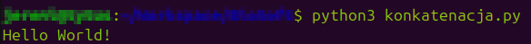

${\color{gray} \small \texttt{Napisał Jeremi Maciejewski}}$
<br/>*[Spis treści kursu](<../README.md#spis-treści>)*

# Typy danych I

Kolejny koncept programistyczny, który omówimy to typy danych.
<br/>Wiesz już, [jak przechowywać dane w zmiennych](<2 Czym sa zmienne.md>), więc czas się dowiedzieć, co konkretnie można w nich przechowywać.

Każda zmienna ma swój typ.
<br/>${\color{lightgray} \tiny \textit{I nie mowa tu o facetach...}}$

Spotkaliśmy się już z dwoma spośród podstawowych typów danych:
- Liczby całkowite (*integer*)
- Tekst (*string*)

Zaczniemy od nich, a następnie przejdziemy do pozostałych typów danych.

## Spis treści
- [Integer](#integer)
- [String](#string)
  - [Metody](#metody)

## Integer
### [🠉](#spis-treści)
Jest to typ danych odpowiadający liczbom całkowitym.
<br/>W Pythonie nazywany jest skrótowo `int`.
<br/>Zmienną typu `int` można stworzyć poprzez przypisanie liczby całkowitej lub za pomocą polecenia `int()`

```py
my_number = 12
second_number = int() # Automatycznie otrzyma wartość 0
```

Na wartościach tego typu można używać *operatorów* matematycznych:
- `+` - dodawanie
- `-` - odejmowanie
- `*` - mnożenie
- `/` - dzielenie
- `//` - dzielenie całkowite (wynik pozbawiony jest części po przecinku, np. `10 / 4` = 2.5, ale `10 // 4` = 2)
- `**` - potęgowanie
- `%` - modulo, czyli reszta z dzielenia (np. `5 / 3` = 1 r.2, zatem `5 % 3` = 2)

Nie ma *operatora*, który umożliwia pierwiastkowanie, ale istnieje na to sprytny sposób:

```py
square_root_of_2 = 2 ** (1/2)
```

Przy okazji użyłem też operatorów otwarcia i zamknięcia nawiasu, których działanie, jak sądzę, jest oczywiste.

> Przypomnienie ze szkoły na wszelki wypadek: ${\Large \sqrt[y]{x} = x^{\frac{1}{y}}}$

## String
### [🠉](#spis-treści)
Typ danych służący do przechowywania tekstu.
<br/>Nazwa 'String' oznacza dosłownie sznurek. Bierze się ona z tego, że każdy string jest *łańcuchem znaków*.
<br/>Znak jest to pojedyncza litera, cyfra itp.

<br/>W Pythonie string jest zwykle nazywany skrótowo `str`.
<br/>Zmienną tego typu można stworzyć poprzez przypisanie tekstu otoczonego cudzysłowem, (pojedynczym lub podwójnym, nie ma to znaczenia. O ile jesteśmy konsekwentni) lub za pomocą polecenia `str()`.

```py
hello = "Cześć!"
empty = str() # Pusty napis
```

Można również stworzyć string wielolinijkowy, o którym wspomniałem już w poprzednim temacie:

```
long = '''Ten tekst
jest trochę zbyt długi,
więc podzieliłem go na
kilka linijek.'''
```

Dane typu string można konkatenować (łączyć, *concatenate*) za pomocą operatora `+`:

```py
a = "Hello"
b = " World!"

print(a + b)
```

`Hello World!`
<!-- ** -->

String można również powielić za pomocą operatora `*`:

```py
a = "Hello"
b = a * 3

print(b)
```

`HelloHelloHello`

<br/>Warto jeszcze zaznaczyć, że dane typu string są *niemutowalne*, czyli niezmienne.
<br/>W praktyce oznacza to, że nie da się ich zmodyfikować - jeśli chcemy np. zmienić jedną literę w jakimś napisie, to musimy cały wyrzucić i zastąpić nowym, ze zmienioną literą.
<br/>

<div id="Metody">

${\color{blue} \huge \textbf{Metody}}$

Dane typu string posiadają cały zestaw metod, czyli specjalnych poleceń, które służą głównie do stworzenia nowego tekstu na podstawie tego, na którym używamy polecenia.
<br/>W związku z niemutowalnością danych typu string, musimy pamiętać, że zawartość zmiennej nie zmieni się sama.
<br/>A więc po użyciu takiej metody zwykle chcemy przypisać wynik jej działania do nowej zmiennej (albo i tej samej, zastępując w ten sposób oryginał).

```py
text = "mój napis"
TEXT = text.upper()

print(text)
print(TEXT)
```

`mój napis`
<br/>`MÓJ NAPIS`
<!--**-->

Użyłem właśnie metody `upper()`, która na podstawie napisu zawartego w zmiennej `text`, stworzyła nowy, zapisany wielkimi literami.
<br/>Zauważ, że zmienna `text` nie zmieniła swojej zawartości. Wynik działania metody musiałem zapisać w zmiennej `TEXT`.
<br/>Co prawda, jeśli nie byłby mi już potrzebny oryginalny napis, mógłbym zrobić tak:

```py
text = "mój napis"
text = text.upper()

print(text)
```

`MÓJ NAPIS`
<!--**-->

Kilka bardziej użytecznych metod, których można użyć na danych typu string znajdziecie poniżej:
- `upper()` - zmienia wszystkie litery na wielkie
- `lower()` - zmienia wszystkie litery na małe
- `capitalize()` - zmienia pierwszą literę na wielką, np. `"ania ma kota".capitalize()` = `"Ania ma kota"`
- `title()` - zmienia pierwszą literę **każdego słowa** na wielką, np. `"ania ma kota".title()` = `"Ania Ma Kota"`
- `replace(x, y)` - zmienia wszystkie wystąpienia litery/słowa `x` na `y`, np. `"ania ma kota".replace('a', '*')` = `"*ni* m* kot*"`
- `count(x)` - zwraca liczbę wystąpień litery/słowa `x`, np. `"ania ma kota".count('a')` = `4`

Takich metod istnieje znacznie więcej. Po kompletną listę odsyłam do [dokumentacji Pythona](https://docs.python.org/3/library/stdtypes.html#string-methods) - choć na razie pewnie ci się nie przyda.

<div id="Slicing">

${\color{blue} \huge \textbf{Slicing}}$

*Slicing* (ang. dosł. kroić) to technika pozwalająca nam "wyciąć" z dłuższego tekstu jakiś jego fragment.
<br/>W tym celu wykorzystuje się operator nawiasów kwadratowych.

Trzeba tu wspomnieć, że każdy znak w string-u - łańcuchu znaków - ma przypisany swój numer, nazywany indeksem (*index*).
<br/>W języku Python pierwszy znak ma zawsze indeks 0.
<br/>Slicing odbywa się poprzez umieszczenie indeksów pierwszego oraz ostatniego znaku we fragmencie, który chcemy wyciąć, wewnątrz operatora nawiasów kwadratowych - oddzielonych dwukropkiem.

```py
chain = "0123456789abcdef"
part1 = chain[0:6]
part2 = chain[9:16]

print(part1)
print(part2)
```

**

Ale zaraz. Czy aby pierwszy fragment nie miał obejmować cyfr od 0 do 6?
<br/>Okazuje się, że dla Pythona "od 0 do 6" oznacza wszystko pomiędzy 0 a 6, ale z wyłączeniem samego 6.
<br/>Trzeba o tym pamiętać, inaczej w kółko będziemy gubili ostatnią literę...

Jeśli chcemy wyciąć fragment obejmujący początek lub koniec stringu, możemy pominąć indeks pierwszego lub ostatniego znaku:

```py
chain = "0123456789abcdef"
part1 = chain[:6]
part2 = chain[9:]
part3 = chain[:] # Whole string from start to beginning!

print(part1)
print(part2)
print(part3)
```

**

Możemy też wyciąć co drugi albo co trzeci itd. znak, dodając trzecią liczbę:

```py
chain = "0123456789abcdef"
part1 = chain[:10:2]
part2 = chain[:10:3]

print(part1)
print(part2)
```

**

No i na koniec, możemy skorzystać z indeksów ujemnych.
<br/>-n-ty indeks oznacza n-ty indeks od końca:
```py
chain = "0123456789abcdef"
#                     🠉-3
part1 = chain[:-3] # 16-3 = 13

print(part1)
```

**

A co się stanie jeśli zamienimy indeksy początku i końca miejscami?
<br/>Przekonaj się sam/a...

<div id="Fstring">

<br/>${\color{blue} \huge \textbf{F-string}}$
