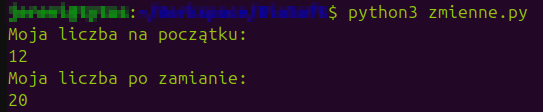

*[Spis treści kursu](<../README.md#spis-treści>)*

# Czym są zmienne?

Zanim zaczniesz pisać skomplikowane programy, istnieje kilka podstawowych konceptów w programowaniu, które musisz zrozumieć i nauczyć się z nimi pracować.
<br/>Pierwszym z nich są *zmienne*.

> Od tego momentu zakładam już, że masz przygotowane i umiesz obsługiwać narzędzia niezbędne do pisania kodu. W przeciwnym razie, zajrzyj do poprzedniej lekcji: [Przygotowanie do kursu](<Przygotowanie do kursu.md>)

## Spis treści
- [Wstęp](#wstęp)
- [Używanie zmiennych](#używanie-zmiennych)
- [A wracając do notatek... - Komentarze](#a-wracając-do-notatek---komentarze)

## Wstęp
### [🠉](#spis-treści)
Niemal każdy program musi przechowywać jakieś informacje.
<br/>Jeśli chcielibyśmy napisać program, który oblicza długość sekwencji DNA, to rzecz jasna nasz program musi najpierw znać tę sekwencję.

Jako użytkownik komputera możesz być przyzwyczajony/a do przechowywania danych w plikach.
<br/>Pracy z plikami (programistycznej) nauczysz się później, ale musisz wiedzieć, że z punktu widzenia programu, odczytywanie i zapisywanie informacji w plikach jest czasochłonne.

Okazuje się, że w plikach "opłaca się" przechowywać tylko większe ilości danych, natomiast kiedy chcemy szybko zapamiętać jakąś krótką informację, zamiast tego lepiej jest skorzystać z szybszego rozwiązania.
<br/>Zmienne do tego właśnie służą. Są to, cytując mojego kolegę Kacpra, "pudełka na dane".

Poza prędkością "zapamiętywania", zmienne różnią się od plików jeszcze jedną rzeczą - są tymczasowe.
<br/>Jeśli zapiszemy sobie jakąś notatkę w pliku, to możemy wyłączyć komputer, pójść na obiad i kiedy znowu go uruchomimy jakieś pół godziny później, nasza notatka wciąż tam będzie.

Natomiast zmienne znikają bezpowrotnie w momencie, kiedy nasz program przestaje działać.
<br/>Więc jeśli musicie sobie zanotować żeby pamiętać o urodzinach babci, lepiej skorzystajcie z kalendarza...

## Używanie zmiennych
### [🠉](#spis-treści)
Aby odróżnić jedną zmienną od drugiej, musimy nadać im ${\color{black} \textbf{unikalne}}$ nazwy.
<br/>Właściwie, nie różni się to wcale od opisywania pudełek ze starymi gratami, które porzucamy w garażu...

```py
moja_liczba = 12
```

Użyłem właśnie *operatora przypisania* (=), aby przypisać zmiennej o nazwie 'moja_liczba' liczbę 12 - a więc "wrzuciłem" liczbę 12 do pudełka i opisałem je 'moja_liczba'.

> ${\color{orange} \small \textit{Uwaga: przy nazywaniu zmiennych musimy trzymać się pewnych zasad.}}$
> ${\color{orange} \small \textit{W nazwie zmiennej mogą znajdować się tylko litery, podkreślniki oraz cyfry - z zastrzeżeniem, że pierwszy znak nazwy nie może być cyfrą.}}$
> ${\color{orange} \small \textit{Tak więc np. spacje odpadają.}}$

Jeśli przeczytałeś poprzednią lekcję, wiesz już, że polecenie `print()` pozwala nam na wypisanie tekstu do konsoli.
<br/>Spróbujmy teraz użyć go, aby zajrzeć do naszego pudełka.

```py
moja_liczba = 12
print(moja_liczba)
```
> ${\color{orange} \small \textit{Uwaga: w przeciwieństwie do wypisywania tekstu, kiedy chcemy wypisać zawartość zmiennej, nie umieszczamy jej nazwy w cudzysłowie.}}$
> ${\color{orange} \small \textit{Dlaczego tak jest, dowiesz się w następnej lekcji.}}$

Jeśli wykonaliście powyższy kod z pliku lub przez konsolę interpretera, powinniście zobaczyć w wynikach liczbę 12.

```py
moja_liczba = 12
moja_liczba2 = 8
```

Jeśli chcemy zapamiętać więcej liczb, musimy im nadać inne nazwy.
> Co prawda da się wrzucić dwie liczby do jednego pudełka, ale na razie lepiej ich nie mieszajmy. Bez obaw, pudełek nam nie zabraknie.

Rzecz jasna, w naszym garażu możemy dwa pudełka opisać dokładnie tak samo, ale wtedy ryzykujemy, że je pomylimy.
<br/>Nasz komputer nie chce ryzykować, że się pomyli, tak więc w programowaniu nie jest to możliwe.
<br/>Jeśli koniecznie chcemy wrzucić coś do pudełka o tej samej nazwie, to musimy najpierw wyrzucić z niego wszystko, co już się w nim znajduje.

```py
moja_liczba = 12
print("Moja liczba na początku:")
print(moja_liczba)

moja_liczba = 20
print("Moja liczba po zamianie:")
print(moja_liczba)
```

Jeśli wykonacie powyższy kod, przekonacie się, że po przypisaniu do zmiennej 'moja_liczba' liczby 20, zniknęła z niego liczba 12, którą wcześniej tam trzymaliśmy.
<br/>**Takiej wyrzuconej zawartości zmiennej nie da się już odzyskać.**

**

A co jeśli nie potrzebujesz już liczby ani pudełka?
<br/>Możesz je wtedy wyrzucić za pomocą polecenia `del` - zauważ, że w tym wypadku nie używamy nawiasów.

```py
moja_liczba = 12
print(moja_liczba)

del moja_liczba
```

## A wracając do notatek... - Komentarze
### [🠉](#spis-treści)
Wiesz już o co chodzi w zmiennych, ale zanim przejdziesz do następnej lekcji, chciałem pokazać ci coś jeszcze.
<br/>Mówiłem, jak to zmienne nie nadają się do przechowywania notatek. Ale podczas pisania kodu notatki są ważne.
<br/>No bo przecież, jeśli porzucimy teraz nasz program i wrócimy do niego za miesiąc, (tak, to się zdarza) to nie będziemy pamiętać, co ta nasza liczba w ogóle oznaczała.

Do zostawiania notatek w kodzie służą **komentarze**.
<br/>Nie wiem, czy już próbowałeś/aś, ale jeśli by tak napisać byle co gdzieś w programie i spróbować go uruchomić, to interpreter zapewne radośnie zapełni twój ekran komunikatami o błędach.
<br/>Jest jednak sposób, żeby Python zupełnie zignorował linijkę takiego nie-kodu - trzeba oznaczyć ją znakiem #.

```py
# Liczba pudełek po butach w moim garażu
moja_liczba = 12
print(moja_liczba)
```

Pierwsza linijka w powyższym kodzie to właśnie komentarz.
<br/>Kiedy Python "widzi" znak #, to wie, że reszta linijki jest komentarzem i w ogóle tam nie zagląda.
<br/>Możliwe jest też napisanie komentarza, który obejmuje więcej niż jedną linijkę. Trzeba tylko otoczyć go trzema znakami cudzysłowu z każdej strony:

```py
# Liczba pudełek po butach w moim garażu
moja_liczba = 12
print(moja_liczba)

'''
Znalazłem jeszcze kilka pudełek,
na strychu i w piwnicy,
a nawet jedno pod łóżkiem.
'''
moja_liczba = 20
print(moja_liczba)
```

> Właściwie, to tak naprawdę nie jest komentarz, tylko wielolinijkowy string. Ale o tym w następnej lekcji...
