*[Spis treści kursu](<../README.md#spis-treści>)*

# Przygotowanie do kursu

Cześć!

Python to jeden z najbardziej popularnych języków programowania na świecie.
<br/>Nadaje się on do różnorodnych zastosowań, choć jako interpretowany język wysokiego poziomu do pewnego stopnia priorytetyzuje wygodę oraz prędkość pisania kodu ponad wydajność programów.

> Dodatek - [Języki interpretowane vs kompilowane](./Assets/Przygotowanie/Bonus.md#języki-interpretowane-vs-kompilowane)

<br/>Zanim zaczniesz programować, musisz najpierw zainstalować wszystkie niezbędne narzędzia.
Przede wszystkim potrzebujesz interpretera języka Python, aby uruchomić swój kod.
> Jeśli jesteś ciekaw, co to interpreter, zajrzyj pod link powyżej.

Dodatkowo, aby napisać jakikolwiek bardziej złożony program, potrzebny ci będzie dowolny edytor tekstu lub IDE
(*Integrated Development Environment*, czyli program, który zawiera w sobie wszystkie podstawowe narzędzia potrzebne programiście).

Poniżej znajdziesz instrukcje instalacji oraz podstaw użytkowania Pythona w środowisku (IDE) Pycharm lub bez niego.
<br/>Jeśli nie masz żadnego doświadczenia z programowaniem i nie wiesz, czy używać IDE, czy nie, to najpierw spróbuj z nim - będzie ci łatwiej na początku.

**Jeśli masz już zainstalowanego Pythona i własny zestaw narzędzi do edycji kodu - możesz pominąć tę lekcję.**

Zwróć uwagę, że wszystkie te programy, włącznie z samym Pythonem, są wciąż rozwijane, więc pewne rzeczy mogły się zmienić od kiedy napisałem ten kurs.
<br/>
## Spis treści
- [Instalacja interpretera Python](#instalacja-interpretera-python)
- [Praca w środowisku Pycharm](#praca-w-środowisku-pycharm)
- [Praca z Pythonem bez IDE](#praca-z-pythonem-bez-ide)
<br/><br/>
## Instalacja interpretera Python
### [🠉](#spis-treści)
Oficjalna strona z paczkami instalacyjnymi: https://www.python.org/downloads/
<br/>Opisuję tu instalację w systemie Windows. Jeśli korzystasz z innego systemu, skorzystaj ze strony powyżej lub sklepu/menedżera pakietów wbudowanego w twój system (np. apt w Linuxach z rodziny Debian)
<br/>
### Z Microsoft Store
Możesz pobrać interpreter z Microsoft Store. Uruchom sklep lub wejdź na jego stronę, wyszukaj "Python" i wybierz dowolną (ale lepiej jedną z najnowszych) wersję.
<br/>Pythona 3.12, którego ja obecnie używam, znajdziesz pod adresem https://apps.microsoft.com/detail/9ncvdn91xzqp?hl=pl-PL&gl=PL .

*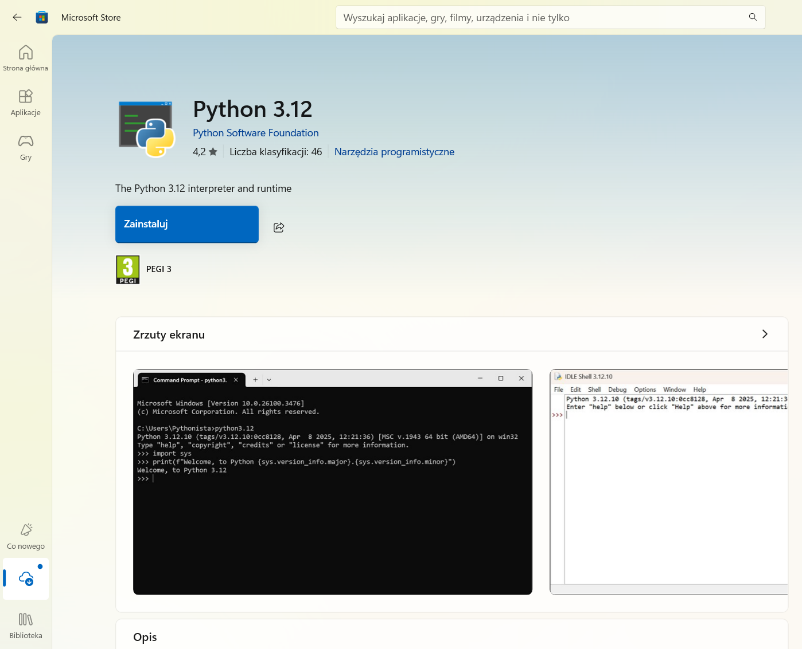*

Następnie kliknij po prostu "Pobierz". Jeśli jesteś w przeglądarce, musisz jeszcze uruchomić pobrany plik.
<br/>W każdym razie system Windows przeprowadzi resztę instalacji automatycznie.
<br/><br/>
### Ręcznie
Jeśli wolisz przeprowadzić instalację ręcznie, wejdź na oficjalną stronę z paczkami do pobrania (link u góry tej sekcji).
<br/>Kliknij żółty przycisk pod napisem "Download the latest source release" aby pobrać najnowszą wersję.
<br/>Inne wersje są dostępne poniżej, ale możliwe, że będziesz się musiał/a trochę naszukać żeby znaleźć tam instalator.

Uruchom pobrany plik - powinno się otworzyć okno instalatora.
<br/>Upewnij się, że okienko "Add python.exe to PATH" jest zaznaczone, a następnie wybierz "Customize installation".

*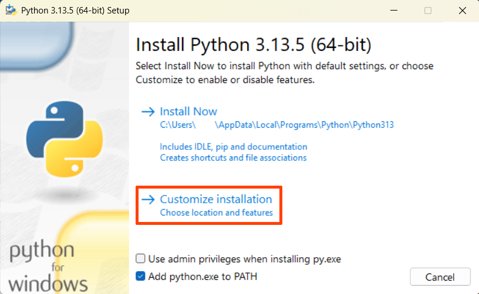*

<br/>W kolejnym oknie po prostu kiliknij "Next".

*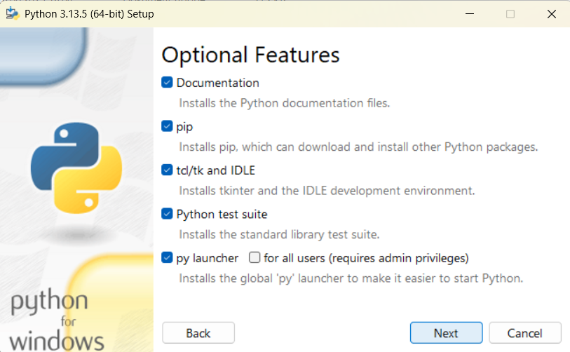*

<br/>W tym oknie zaznacz opcje:<br/>
- "Associate files with Python (requires the 'py' launcher)"
- "Create shortcuts for installed applications"
- "Add Python to environment variables"
- "Precompile standard library"

W okienku na dole możesz wybrać miejsce instalacji.
<br/>Kliknij teraz "Install", aby rozpocząć instalację.

*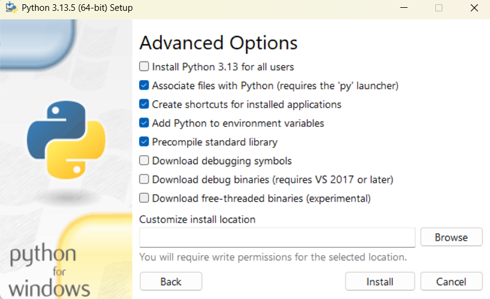*

Po zakończeniu instalacji możesz już zamknąć okno.
<br/><br/>
## Praca w środowisku Pycharm
### [🠉](#spis-treści)
IDE takie jak Pycharm to najwygodniejsza opcja jeśli chodzi o narzędzia do tworzenia kodu, oferująca wiele ułatwień.
<br/>Poza Pycharmem istnieją też inne opcje, które możesz wypróbować (jeśli instalowałeś/aś Pythona w systemie Windows, prawdopodobnie masz już też dołączone do niego, minimalistyczne środowisko IDLE).

### Instalacja
Ponownie, opisuję instalację na systemie Windows, ale z tej samej strony możesz również pobrać Pycharm na inne systemy.
<br/><br/>
Wejdź na stronę https://www.jetbrains.com/pycharm/download/ i kliknij na przycisk "Download" (ten poniżej, nie w nagłówku strony).
<br/>Uruchom pobrany plik instalatora. Prawdopodobnie będziesz musiał/a zezwolić na użycie uprawnień administratora.
<br/>W pierwszym oknie kliknij "Next", następnie wybierz miejsce instalacji, "Next" i zaznacz wszystkie opcje (może poza "Create Dektop Shortcut", jeśli nie chcesz skrótu na pulpicie)

*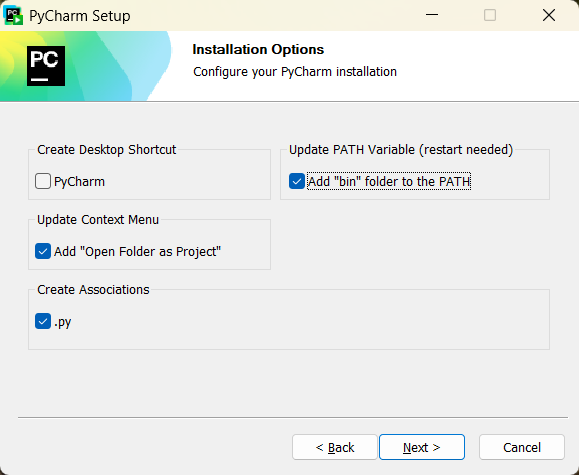*

"Next", folder Start Menu możesz zostawić domyślny. No i na koniec "Install".
<br/>
<br/>Po zakończeniu instalacji konieczny będzie restart komputera.
<br/>Upewnij się, że masz wszystko zapisane, zaznacz "Reboot now" i kliknij "Finish".
<br/>
<br/>Twój komputer zostanie zrestartowany, po czym będziesz już mógł/mogła uruchomić Pycharm.
<br/><br/>
### Używanie
> Uwaga: przedstawiam tu tylko kilka podstawowych funkcji, które oferuje środowisko Pycharm. Ja sam nie używam go na co dzień, więc nie znam wielu z jego funkcji.
<br/>
Przy pierwszym uruchomieniu, Pycharm zapewne zapyta się o wersję "pro". Po prostu zamknij okno, które wyskoczy lub wybierz, że zostajesz przy darmowej wersji i pozwól mu zrestartować program w wersji darmowej.
<br/>
<br/>Zobaczysz zapewne (mniej więcej) taki ekran startowy:

<br/>*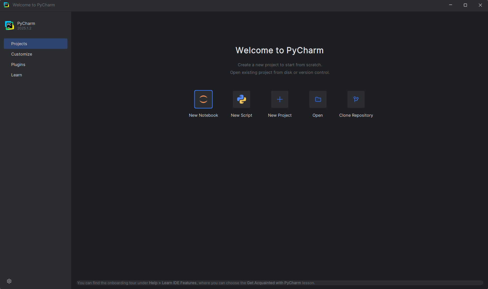*

Wybierz "New project".
<br/>Otworzy się okno tworzenia nowego projektu.
<br/>W pasku u góry możesz wybrać lokalizację, w której będą przechowywane pliki tego projektu (albo po prostu zostaw domyślną).
<br/>Upewnij się, że w panelu po lewej wybrana jest opcja "Pure Python", a następnie w opcji "Interpreter type" zaznacz "Custom environment".
<br/><br/>W menu, które się pojawi, zaznacz:
<br/>**Environment:** Select existing
<br/>**Type:** Python

<br/>Następnie kliknij "Create".

*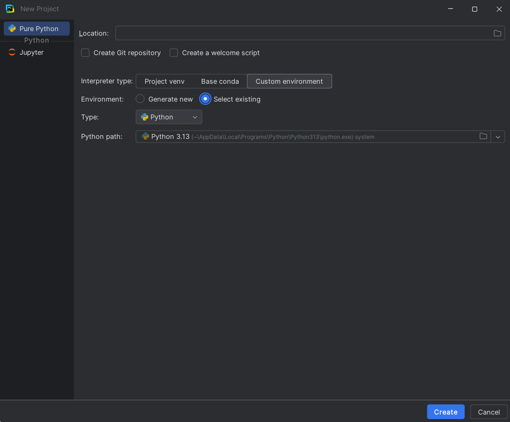*

> To nieco bardziej zaawansowana kwestia, ale jeśli jesteś ciekaw/a, to wyjaśniam, co właśnie zrobiliśmy [tutaj](./Assets/Przygotowanie/Bonus.md#środowiska_wirtualne).

Otworzy się pusty projekt.
<br/>W centrum ekranu znajdują się 2 główne panele - drzewo plików po lewej, oraz panel, w którym widać zawartość otwartych plików, po prawej.
<br/>Na samym skraju okna po lewej jest również wąski pasek narzędzi, w którym możesz schować albo zmodyfikować lewy panel, a także otworzyć trzeci panel u dołu ekranu.

Jak na razie w plikach powinieneś/powinnaś widzieć pusty folder o nazwie twojego projektu, (jeśli nie zmieniałeś/aś lokalizacji projektu jest to zapewne coś w rodzaju "PythonProject") folder "External Libraries" oraz "Scratches and Consoles".
<br/>Dwa ostatnie możesz na tę chwilę zupełnie zignorować.

<details>
<summary>${\color{gray} \textit{Jesteś ciekaw czym są?}}$</summary>
"External Libraries" to folder, w którym zawierają się pliki twojej instalacji Pythona (w tym ewentualne dodatkowe biblioteki, gdybyś miał/a jakieś zainstalowane).
<br/>Możesz tam znaleźć między innymi kod programistyczny, który tworzy sam język Python (choć ostrzegam, nawet mi jest trudno się w nim połapać. Możesz tam zajrzeć w ramach ciekawostki, ale w rzeczywistości bardzo trudno czegokolwiek się w ten sposób dowiedzieć).

Folder "Scratches and Consoles" służy do tworzenia plików i notatek, które nie są "przywiązane" do projektu, w którym obecnie pracujesz, i do których można się dostać również z poziomu innych projektów.
</details>

*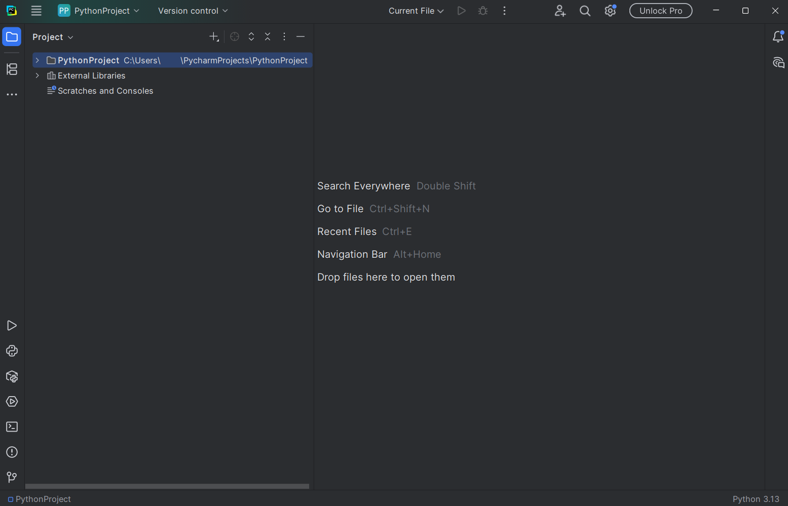*

Kliknij teraz prawym przyciskiem myszy na folder twojego projektu.
<br/>Powinno otworzyć się menu kontekstowe. Najedź na opcję "New" u jego szczytu i wybierz "Python File".

*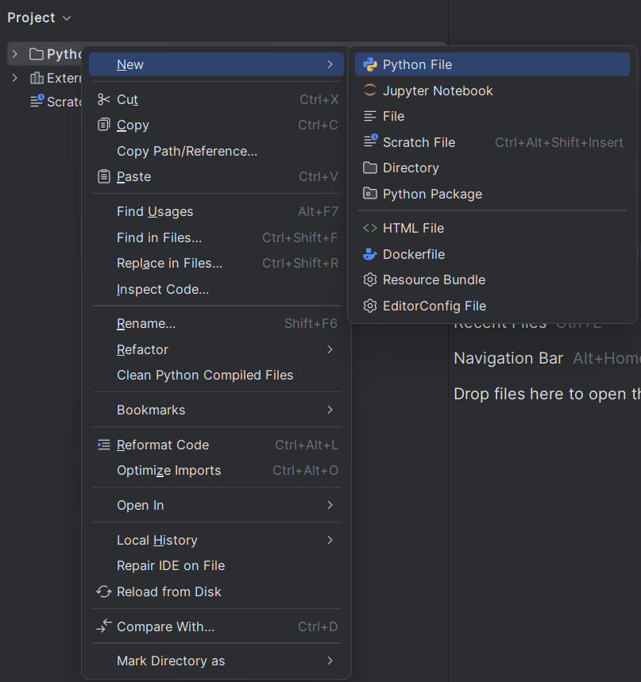*

W okienku, które wyskoczy, wpisz nazwę swojego pierwszego programu - zgodnie z programistyczną tradycją, proponuję, żeby było to "Hello.py".

> '.py' jest rozszerzeniem nazwy pliku, które informuje użytkownika oraz system, że plik zawiera kod napisany w języku Python.

Stworzyłeś/aś właśnie swój pierwszy plik z kodem. W panelu z drzewem plików powinien być teraz widoczny plik z wybraną nazwą i symbolem Pythona (jeśli go nie widzisz, kliknij na folder prejktu, aby otworzyć jego zawartość).
<br/>Natomiast w panelu po prawej otwarło się teraz okno edycji pliku.

*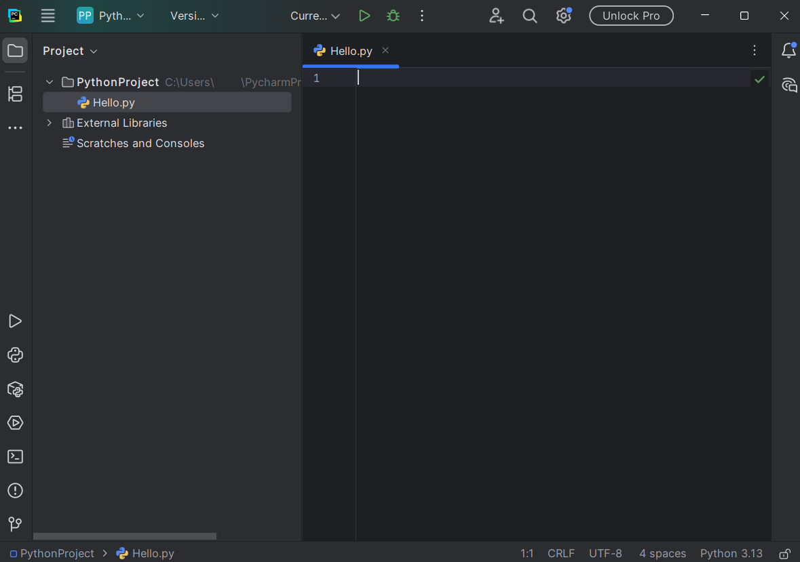*

Napisz teraz swój pierwszy program (również zgodnie z programistyczną tradycją).
<br/>Przepisz (lub lepiej, przekopiuj) po prostu kod poniżej do okna edycji pliku:
```py
print("Hello World!")
```

Kiedy skończysz, kliknij na zielony trójkąt ponad panelem edycji pliku, aby uruchomić swój program.
<br/>Automatycznie wyskoczy dolny panel z wynikami działania programu.

*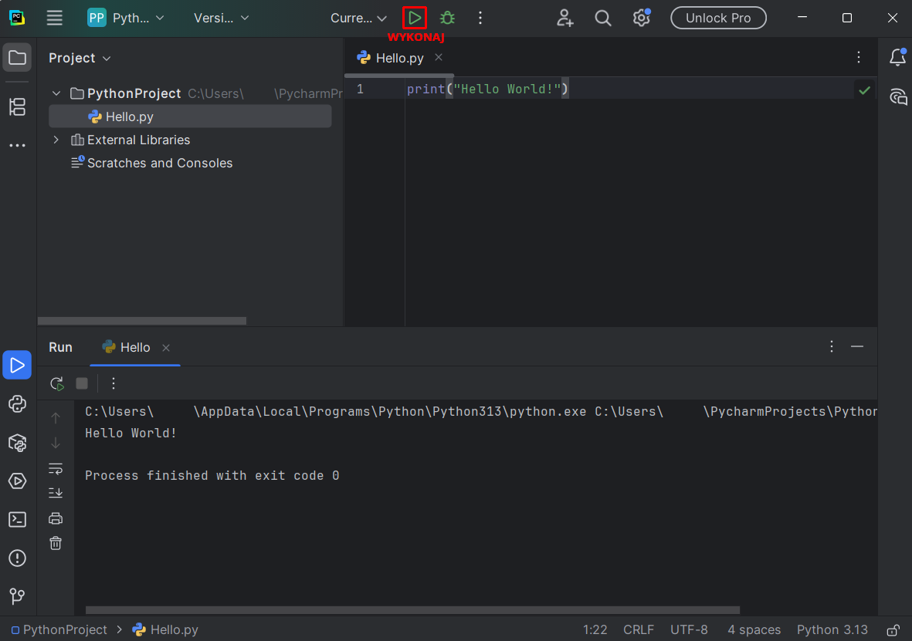*

Przeanalizujmy dokładniej, co zawierają:

*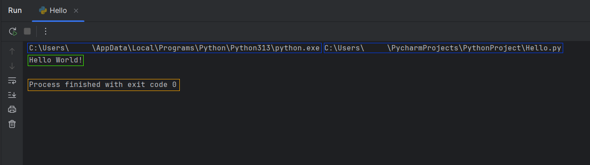*

Dwa napisy zaznaczone na ${\color{blue} \textbf{niebiesko}}$ to polecenie, które Pycharm wykonał w powłoce systemowej (terminalu), aby uruchomić twój program.
<br/>Odpowiadają one lokalizacji dwóch programów, które zostały uruchomione - pierwszego, interpretera Pythona, oraz drugiego, twojego (uruchomionego już *przez* Pythona).

Napis w ${\color{green} \textbf{zielonej}}$ ramce to informacja, którą wypisał twój program - to właśnie robi polecenie `print()`, którego użyliśmy.
<br/>Spróbuj zmienić napis w cudysłowiu wewnątrz tego polecenia i uruchom program ponownie, a zobaczysz, że napis w wynikach również się zmieni.

Napis zaznaczony na ${\color{orange} \textbf{pomarańczowo}}$ to informacja o zakończeniu działania programu. W tym wypadku program zakończył działanie i automatycznie wysłał do systemu informację zwrotną w postaci liczby 0 - tak właśnie powinno być.

> Co prawda liczba, którą zwraca program może być zmieniona wedle woli programisty, ale przyjęło się, że liczba 0 oznacza pomyślne zakończenie działania programu, natomiast każda inna oznacza, że program zakończył działanie w wyniku jakiegoś błędu.

Przyjrzyjmy się teraz paskowi narzędziowemu po lewej:

*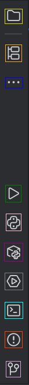*

Po kolei od góry do dołu:
- ${\color{dandelion} \textbf{Panel z drzewem plików}}$
- ${\color{orange} \textbf{Panel struktury kodu}}$ - przydatny przy nawigowaniu w kodzie bardziej skomplikowanych programów, w przypadku Hello.py raczej nic tam nie zobaczysz.
- ${\color{blue} \textbf{Dodatkowe panele}}$ - można tam znaleźć sporo dodatkowych funkcji, ale trudno, żeby opisywał wszystkie.
- ${\color{green} \textbf{Wyniki uruchomienia programu}}$
- ${\color{pink} \textbf{Konsola interpretera}}$ - możesz tu wykonywać Pythonowy kod bez tworzenia pliku - spróbuj przekopiować tu linijkę kodu z Hello.py i kliknąć Enter a by wykonać.
- ${\color{purple} \textbf{Dodatkowe paczki}}$ - można tu przejrzeć zainstalowane dodatkowe "narzędzia", ale na razie nie będziemy z nich korzystać.
- ${\color{gray} \textbf{Usługi}}$ - to zaawansowana funkcja Pycharm, która pozwala na połączenie dodatkowych funkcji ze swoim IDE.
- ${\color{cyan} \textbf{Terminal}}$ - tudzież powłoka systemowa - to poprzez nią tak naprawdę odbywa się uruchomienie twojego programu. Jeśli przekopiujesz tutaj linijkę, którą zaznaczyłem na niebiesko w wynikach Hello.py, uruchomisz go "ręcznie", bez pośrednictwa Pycharma.
- ${\color{red} \textbf{Błędy}}$ - znajdziesz tu listę błędów w kodzie, które automatycznie wykryło IDE.
- ${\color{plum} \textbf{Kontrola wersji}}$ - służy do wersjonowania kodu, nie przyda ci się dopóki nie zabierzesz się za jakiś duży, długterminowy projekt.

Ostatnią ważną rzeczą jest pasek z narzędziami ukryty pod przyciskiem z poziomymi paskami w lewym górnym rogu.
<br/>Po jego kliknięciu pojawi się cały szereg zakładek z wieloma opcjami, ale najistotniejsze z nich znajdują się w zakładce "File".
- New project - pozwala stworzyć nowy projekt
- New File or Directory - inny sposób na stworzenie nowego pliku lub folderu
- Close Project - zamyka obecny projekt i powraca do ekranu startowego
- Settings - otwiera obszerne menu z rozmaitymi ustawieniami

To by było na tyle jeśli chodzi o krótki wstęp w programowaniu w Pycharm. Jeśli postanowisz korzystać z niego w przyszłości z pewnością samemu odkryjesz wiele innych możliwości, jakie oferuje.

${\color{green} \textbf{Jesteś teraz gotów/gotowa aby przejść do lekcji numer 2:}}$ [Czym są zmienne?](<./Czym są zmienne.md>)
<br/><br/>
## Praca z Pythonem bez IDE
### [🠉](#spis-treści)
Jeśli przytłacza cię multum opcji i ułatwień, które oferują IDE albo chcesz spróbować programowania bez ułatwień w postaci specjalistycznego oprogramowania, to rzecz jasna, wszystko da się zrobić bez instalowania dodatkowych narzędzi (poza Pythonem rzecz jasna).

Bedzie ci potrzebny terminal/powłoka systemowa - w systemie Windows jest to Command Line ("wiersz polecenia") lub PowerShell - oraz dowolny edytor tekstu.
<br/>Może to być Notepad, Notepad++, nano, Vim, VS Code itp.
<br/>Jeśli używasz Windowsa, na pewno masz już Notepad, aczkolwiek o ile nie poszukujesz naprawdę ***szczególnego*** wyzwania, zalecałbym jednak coś wygodniejszego, chociażby Notepad++.

Nie będę tu opisywał dostępnych opcji - musisz sam/a znaleźć coś dla siebie.

Kiedy już będziesz mmiał/a edytor tekstu, otwórz terminal właściwy dla swojego systemu - w systemie Windows wpisz po prostu w pasek wyszukiwania "PowerShell" i uruchom aplikację która wyskoczy.
<br/>Powita cię zapewne proste, jednokolorowe okno z jakimś tekstem powitalnym.

*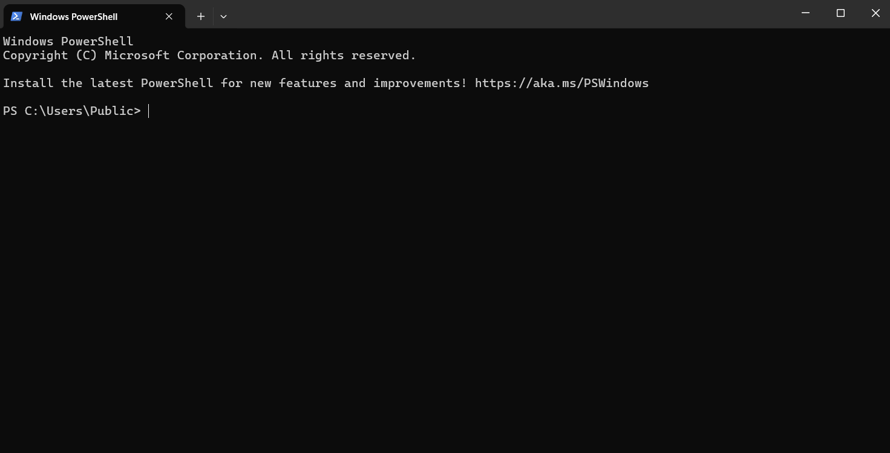*

Ten najniżej wskazuje na ścieżkę, (folder) w której się obecnie znajdujesz.

Na początek wypróbujmy Pythona.
<br/>O ile został on zainstalowany poprawnie, wpisanie któregoś z poniższych poleceń i zatwierdzenie enterem powinno wyświetlić komunikat o uruchomieniu Pythona. (przetestuj wszystkie, któreś powinno zadziałać)
<br/>`py`, `python`, `python3`
<br/>Jeśli otrzymujesz komunikat o nierozpoznanym poleceniu albo zostajesz wysłany na stronę Pythona w sklepie - to raczej nie to.

*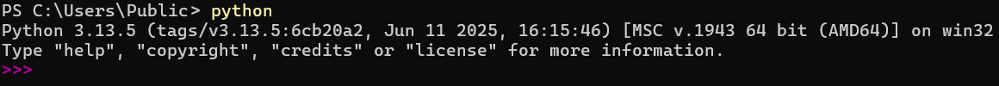*

Jeśli już znalazłeś/łaś tę właściwą opcję, znajdujesz się teraz w konsoli interpretera. Niewiele się zmieniło prawda? Cóż, jeszcze jest szansa żeby wrócić do ładnego IDE... 😉
<br/>Wpisz lub przekopiuj do interpretera poniższe polecenie:
```py
print("Hello World")
```

I zatwierdź klikając enter.

*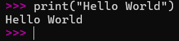*


<br/>Pierwsze wykonane przez ciebie polecenie programistyczne nie jest być może zbyt spektakularne, ale to dobry początek.
<br/>Funkcja `print()` wypisuje tekst to konsoli.
<br/>(na razie może się to wydawać mało użyteczne, ale później okaże się przydatne)

<br/>Narazie wyjdźmy z interpretera. Możesz go opuścić, wpisując polecenie `quit()` lub `exit()`.

Stwórz teraz, za pomocą swojego edytora tekstu, nowy plik o nazwie "Hello.py" i przekopiuj do niego ten sam kod:
```py
print("Hello World")
```

*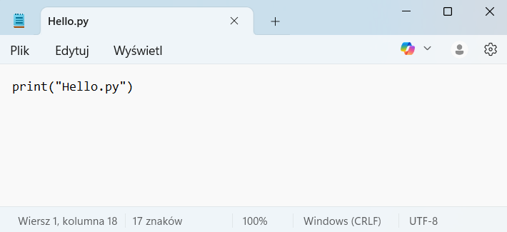*
<br/>${\color{gray} \scriptsize \textit{To jest Notepad. Ale nie bierz ze mnie przykładu. Na co dzień używam nano.}}$
<br/>${\color{gray} \scriptsize \textit{...Tu w sumie też nie bierz ze mnie przykładu, są wygodniejsze opcje.}}$

Teraz za pomocą terminala spróbujemy znaleźć ten plik. Ale najpierw pozbądźmy się niepotrzebnego tekstu, który zaśmieca nam terminal.
<br/>Zrobisz to poleceniem `cls` (PowerShell i cmd, od *CLear Screen) lub `clear` (niektóre inne terminale/powłoki, np. bash).

Jak wspomniałem, napis przed polem do wpisywania poleceń wskazuje na lokalizację, w której obecnie się znajdujesz.
<br/>Lokalizację w większości terminali zmienia się poleceniem `cd` (od *Change Directory*). Jeśli więc na przykład stworzyłeś swój plik w folderze "Python" na dysku C, to możesz się tam dostać za pomocą polecenia:
<br/>`cd C:\Python\`

Jeśli nie wiesz, jaka *ścieżka* prowadzi do twojego pliku, być może łatwiej będzie ci znaleźć go najpierw w swoim systemowym eksploratorze plików. Jeśli wejdziesz we właściwości tego pliku, powinna się tam znajdować informacja o jego lokalizacji (zwykle: prawy przycisk myszy na pliku -> właściwości).

Upewnij się tylko, że zmieniasz lokalizację na folder, nie na plik!
<br/>Np. `cd C:\Python\` a nie `C:\Python\Hello.py`

<details>
<summary>Inne detale nawigacji za pomocą cd</summary>
Warto wiedzieć, że nie zawsze trzeba wpisywać całą ścieżkę. Jeśli np. znajdujemy się w `C:\Python\`, w którym jest folder "Programy", to możemy do niego przejść za pomocą:
<br/>`cd Programy` lub `cd ./Programy` (kropka oznacza lokalizację, w której obecnie się znajdujemy.

Jeśli następnie chcielibyśmy wrócić do `C:\Python`, możemy skorzystać z operatora dwóch kropek:
<br/>`cd ..`
<br/>Symbolizują one folder nadrzędny (poprzedni).
</details>

Kiedy znajdziesz się już w docelowym folderze, być może chciałbyś/chciałabyś sprawdzić, co się w nim znajduje. Zrobisz to poleceniem `dir` (PowerShell / cmd) lub `ls` (bash).

No dobrze, a teraz uruchommy wreszcie ten program. Zrobisz to poprzez połączenie polecenia uruchamiającego Pythona oraz nazwy pliku (właściwie - poprzez *przekazanie* nazwy pliku Pythonowi).
<br/>`py Hello.py`, `python3 Hello.py` itp.

*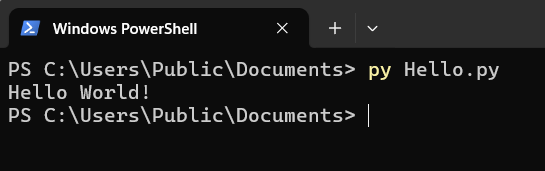*

W ten sposób możesz napisać dowolny program w swoim edytorze tekstu, a następnie uruchomić go z poziomu terminala.
<br/>Na koniec możesz zamknąć terminal poleceniem `exit`.

${\color{green} \textbf{Jesteś teraz gotów/gotowa aby przejść do lekcji numer 2:}}$ [Czym są zmienne?](<./Czym są zmienne.md>)
