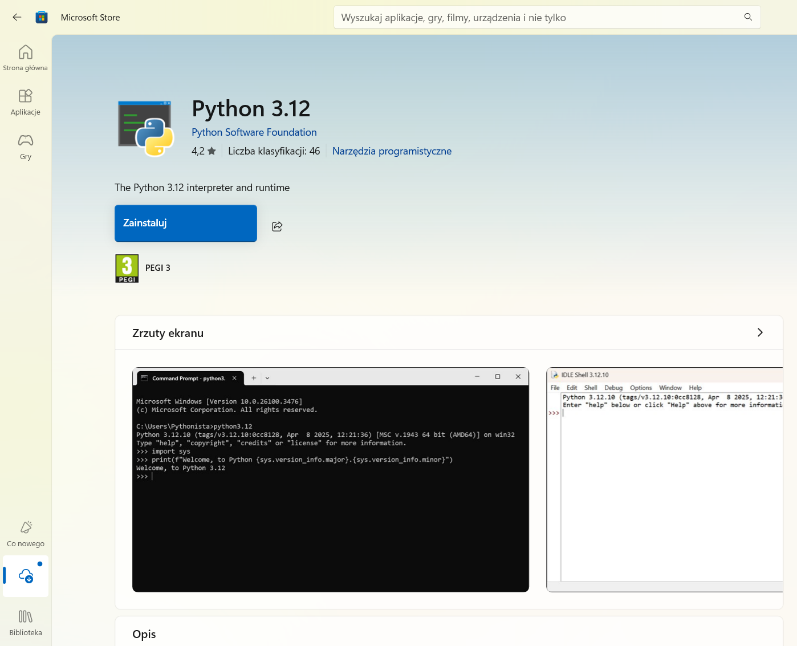
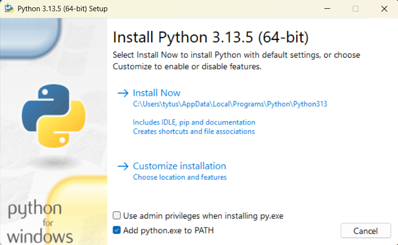
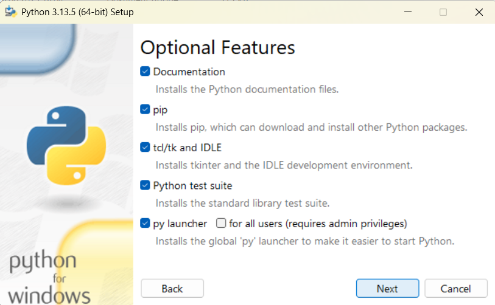
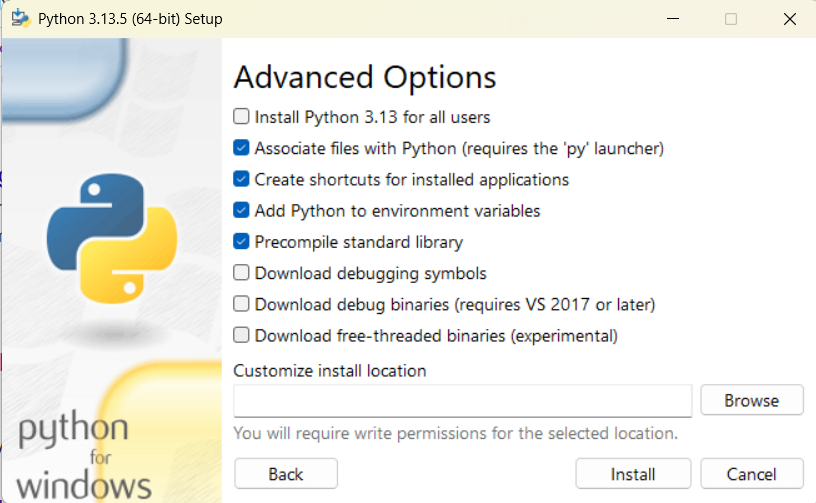
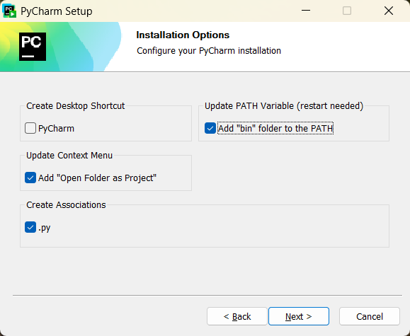

# Przygotowanie do kursu

Cześć!

Zanim zaczniesz programować, musisz najpierw zainstalować wszystkie niezbędne narzędzia.
Przede wszystkim potrzebujesz interpretera języka Python, aby uruchomić swój kod.

Dodatkowo, aby napisać jakikolwiek bardziej złożony program, potrzebny ci będzie dowolny edytor tekstu lub IDE
(*Integrated Development Environment*, czyli program, który zawiera w sobie wszystkie podstawowe narzędzia potrzebne programiście).

Poniżej znajdziesz instrukcje instalacji oraz podstaw użytkowania Pythona w środowisku (IDE) Pycharm, lub bez niego, z dowolnym edytorem tekstu.
Jeśli nie masz żadnego doświadczenia z programowaniem i nie wiesz, czy używać IDE, czy nie, to najpierw spróbuj z nim - będzie ci łatwiej na początku.

Zwróć uwagę, że wszystkie te programy, włącznie z samym Pythonem są wciąż rozwijane, więc pewne rzeczy mogły się zmienić od kiedy napisałem te instrukcje.
 
## Spis treści
- [Instalacja interpretera Python](#instalacja-interpretera-python)
- [Używanie Pythona w środowisku Pycharm](#używanie-pythona-w-środowisku-pycharm)
- [Używanie Pythona z edytorem tekstu](#używanie-pythona-z-edytorem-tekstu)
  
## Instalacja interpretera Python
Oficjalna strona z paczkami instalacyjnymi: https://www.python.org/downloads/
 Opisuję tu instalację w systemie Windows. Jeśli korzystasz z innego systemu, skorzystaj ze strony powyżej lub sklepu/menedżera pakietów wbudowanego w twój system (np. apt w Linuxach z rodziny Debian)
 
### Z Microsoft Store
Możesz pobrać interpreter z Microsoft Store. Uruchom sklep lub wejdź na jego stronę, wyszukaj "Python" i wybierz dowolną (ale lepiej jedną z najnowszych) wersję.
Pythona 3.12, którego ja obecnie używam, znajdziesz pod adresem https://apps.microsoft.com/detail/9ncvdn91xzqp?hl=pl-PL&gl=PL .

**

Następnie kliknij po prostu "Pobierz". Jeśli jesteś w przeglądarce, musisz jeszcze uruchomić pobrany plik.
W każdym razie system Windows przeprowadzi resztę instalacji automatycznie.
  
### Ręcznie
Jeśli wolisz przeprowadzić instalację ręcznie, wejdź na oficjalną stronę z paczkami do pobrania (link u góry tej sekcji).
 Kliknij żółty przycisk pod napisem "Download the latest source release" aby pobrać najnowszą wersję.
 Inne wersje są dostępne poniżej, ale możliwe, że będziesz się musiał/a trochę naszukać żeby znaleźć tam instalator.

Uruchom pobrany plik - powinno się otworzyć okno instalatora.
Upewnij się, że okienko "Add python.exe to PATH" jest zaznaczone, a następnie wybierz "Customize installation".

**

 W kolejnym oknie po prostu kiliknij "Next".

**

 W tym oknie zaznacz opcje: 
- "Associate files with Python (requires the 'py' launcher)"
- "Create shortcuts for installed applications"
- "Add Python to environment variables"
- "Precompile standard library"

W okienku na dole możesz wybrać miejsce instalacji.
 Kliknij teraz "Install", aby rozpocząć instalację.

**

Po zakończeniu instalacji możesz już zamknąć okno.
  
## Używanie Pythona w środowisku Pycharm
IDE takie jak Pycharm to najwygodniejsza opcja jeśli chodzi o narzędzia do tworzenia kodu, oferująca wiele ułatwień.
 Poza Pycharmem istnieją też inne opcje, które możesz wypróbować (jeśli instalowałeś/aś Pythona w systemie Windows, prawdopodobnie masz już też dołączone do niego, minimalistyczne środowisko IDLE).

### Instalacja
Ponownie, opisuję instalację na systemie Windows, ale z tej samej strony możesz również pobrać Pycharm na inne systemy.
  
Wejdź na stronę https://www.jetbrains.com/pycharm/download/ i kliknij na przycisk "Download" (ten poniżej, nie w nagłówku strony).
 Uruchom pobrany plik instalatora. Prawdopodobnie będziesz musiał/a zezwolić na użycie uprawnień administratora.
 W pierwszym oknie kliknij "Next", następnie wybierz miejsce instalacji, "Next" i zaznacz wszystkie opcje (może poza "Create Dektop Shortcut", jeśli nie chcesz skrótu na pulpicie)

**

"Next", folder Start Menu możesz zostawić domyślny. No i na koniec "Install".
 
Po zakończeniu instalacji konieczny będzie restart komputera. Upewnij się, że masz wszystko zapisane, zaznacz "Reboot now" i kliknij "Finish".
 Twój komputer zostanie zrestartowany, po czym będziesz już mógł/mogła uruchomić Pycharm.
