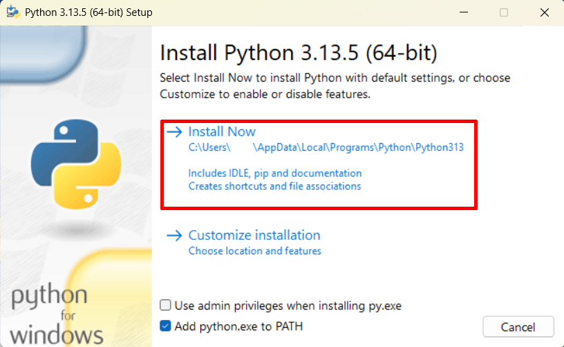

# Przygotowanie do kursu

Cześć!

Python to jeden z najbardziej popularnych języków programowania na świecie.
<br/>Nadaje się on do różnorodnych zastosowań, choć jako interpretowany język wysokiego poziomu do pewnego stopnia priorytetyzuje wygodę oraz prędkość pisania kodu ponad wydajność programów.

> Dodatek - [Języki interpretowane vs kompilowane](./Assets/przygotowanie/Bonus.md#języki-interpretowane-vs-kompilowane)

<br/>Zanim zaczniesz programować, musisz najpierw zainstalować wszystkie niezbędne narzędzia.
Przede wszystkim potrzebujesz interpretera języka Python, aby uruchomić swój kod.
> Jeśli jesteś ciekaw, co to interpreter, zajrzyj pod link powyżej.

Dodatkowo, aby napisać jakikolwiek bardziej złożony program, potrzebny ci będzie dowolny edytor tekstu lub IDE
(*Integrated Development Environment*, czyli program, który zawiera w sobie wszystkie podstawowe narzędzia potrzebne programiście).

Poniżej znajdziesz instrukcje instalacji oraz podstaw użytkowania Pythona w środowisku (IDE) Pycharm lub bez niego.
<br/>Jeśli nie masz żadnego doświadczenia z programowaniem i nie wiesz, czy używać IDE, czy nie, to najpierw spróbuj z nim - będzie ci łatwiej na początku.

**Jeśli masz już zainstalowanego Pythona i własny zestaw narzędzi do edycji kodu - możesz pominąć tę lekcję.**

Zwróć uwagę, że wszystkie te programy, włącznie z samym Pythonem są wciąż rozwijane, więc pewne rzeczy mogły się zmienić od kiedy napisałem te instrukcje.
<br/>
## Spis treści
- [Instalacja interpretera Python](#instalacja-interpretera-python)
- [Praca w środowisku Pycharm](#praca-w-środowisku-pycharm)
- [Praca z Pythonem bez IDE](#praca-z-pythonem-bez-ide)
<br/><br/>
## Instalacja interpretera Python
### [🠉](#spis-treści)
Oficjalna strona z paczkami instalacyjnymi: https://www.python.org/downloads/
<br/>Opisuję tu instalację w systemie Windows. Jeśli korzystasz z innego systemu, skorzystaj ze strony powyżej lub sklepu/menedżera pakietów wbudowanego w twój system (np. apt w Linuxach z rodziny Debian)
<br/>
### Z Microsoft Store
Możesz pobrać interpreter z Microsoft Store. Uruchom sklep lub wejdź na jego stronę, wyszukaj "Python" i wybierz dowolną (ale lepiej jedną z najnowszych) wersję.
Pythona 3.12, którego ja obecnie używam, znajdziesz pod adresem https://apps.microsoft.com/detail/9ncvdn91xzqp?hl=pl-PL&gl=PL .

**

Następnie kliknij po prostu "Pobierz". Jeśli jesteś w przeglądarce, musisz jeszcze uruchomić pobrany plik.
W każdym razie system Windows przeprowadzi resztę instalacji automatycznie.
<br/><br/>
### Ręcznie
Jeśli wolisz przeprowadzić instalację ręcznie, wejdź na oficjalną stronę z paczkami do pobrania (link u góry tej sekcji).
<br/>Kliknij żółty przycisk pod napisem "Download the latest source release" aby pobrać najnowszą wersję.
<br/>Inne wersje są dostępne poniżej, ale możliwe, że będziesz się musiał/a trochę naszukać żeby znaleźć tam instalator.

Uruchom pobrany plik - powinno się otworzyć okno instalatora.
Upewnij się, że okienko "Add python.exe to PATH" jest zaznaczone, a następnie wybierz "Customize installation".

**

<br/>W kolejnym oknie po prostu kiliknij "Next".

**

<br/>W tym oknie zaznacz opcje:<br/>
- "Associate files with Python (requires the 'py' launcher)"
- "Create shortcuts for installed applications"
- "Add Python to environment variables"
- "Precompile standard library"

W okienku na dole możesz wybrać miejsce instalacji.
<br/>Kliknij teraz "Install", aby rozpocząć instalację.

**

Po zakończeniu instalacji możesz już zamknąć okno.
<br/><br/>
## Praca w środowisku Pycharm
### [🠉](#spis-treści)
IDE takie jak Pycharm to najwygodniejsza opcja jeśli chodzi o narzędzia do tworzenia kodu, oferująca wiele ułatwień.
<br/>Poza Pycharmem istnieją też inne opcje, które możesz wypróbować (jeśli instalowałeś/aś Pythona w systemie Windows, prawdopodobnie masz już też dołączone do niego, minimalistyczne środowisko IDLE).

### Instalacja
Ponownie, opisuję instalację na systemie Windows, ale z tej samej strony możesz również pobrać Pycharm na inne systemy.
<br/><br/>
Wejdź na stronę https://www.jetbrains.com/pycharm/download/ i kliknij na przycisk "Download" (ten poniżej, nie w nagłówku strony).
<br/>Uruchom pobrany plik instalatora. Prawdopodobnie będziesz musiał/a zezwolić na użycie uprawnień administratora.
<br/>W pierwszym oknie kliknij "Next", następnie wybierz miejsce instalacji, "Next" i zaznacz wszystkie opcje (może poza "Create Dektop Shortcut", jeśli nie chcesz skrótu na pulpicie)

**

"Next", folder Start Menu możesz zostawić domyślny. No i na koniec "Install".
<br/>
<br/>Po zakończeniu instalacji konieczny będzie restart komputera.
<br/>Upewnij się, że masz wszystko zapisane, zaznacz "Reboot now" i kliknij "Finish".
<br/>
<br/>Twój komputer zostanie zrestartowany, po czym będziesz już mógł/mogła uruchomić Pycharm.
<br/><br/>
### Używanie
> Uwaga: przedstawiam tu tylko kilka podstawowych funkcji, które oferuje środowisko Pycharm. Ja sam nie używam go na co dzień, więc nie znam wielu z jego funkcji.
<br/>
Przy pierwszym uruchomieniu, Pycharm zapewne zapyta się o wersję "pro". Po prostu zamknij okno, które wyskoczy lub wybierz, że zostajesz przy darmowej wersji i pozwól mu zrestartować program w wersji darmowej.
<br/>
<br/>Zobaczysz zapewne (mniej więcej) taki ekran startowy:

**

Wybierz "New project".
<br/>Otworzy się okno tworzenia nowego projektu.
<br/>W pasku u góry możesz wybrać lokalizację, w której będą przechowywane pliki tego projektu (albo po prostu zostaw domyślną).
<br/>Upewnij się, że w panelu po lewej wybrana jest opcja "Pure Python", a następnie w opcji "Interpreter type" zaznacz "Custom environment".
<br/><br/>W menu, które się pojawi, zaznacz:
<br/>**Environment:** Select existing
<br/>**Type:** Python

<br/>Następnie kliknij "Create".

**

> To nieco bardziej zaawansowana kwestia, ale jeśli jesteś ciekaw/a, to wyjaśniam, co właśnie zrobiliśmy [tutaj](./Assets/przygotowanie/Bonus.md#środowiska_wirtualne).

Otworzy się pusty projekt.
<br/>W centrum ekranu znajdują się 2 główne panele - drzewo plików po lewej, oraz panel, w którym widać zawartość otwartych plików, po prawej.
<br/>Na samym skraju okna po lewej jest również wąski pasek narzędzi, w którym możesz schować albo zmodyfikować lewy panel, a także otworzyć trzeci panel u dołu ekranu.

Jak na razie w plikach powinieneś/powinnaś widzieć pusty folder o nazwie twojego projektu, (jeśli nie zmieniałeś/aś lokalizacji projektu jest to zapewne coś w rodzaju "PythonProject") folder "External Libraries" oraz "Scratches and Consoles".
<br/>Dwa ostatnie możesz na tę chwilę zupełnie zignorować.

<details>
<summary>${\color{gray} \textit{Jesteś ciekaw czym są?}}$</summary>
"External Libraries" to folder, w którym zawierają się pliki twojej instalacji Pythona (w tym ewentualne dodatkowe biblioteki, gdybyś miał/a jakieś zainstalowane).
<br/>Możesz tam znaleźć między innymi kod programistyczny, który tworzy sam język Python (choć ostrzegam, nawet mi jest trudno się w nim połapać. Możesz tam zajrzeć w ramach ciekawostki, ale w rzeczywistości bardzo trudno czegokolwiek się w ten sposób dowiedzieć).

Folder "Scratches and Consoles" służy do tworzenia plików i notatek, które nie są "przywiązane" do projektu, w którym obecnie pracujesz, i do których można się dostać również z poziomu innych projektów.
</details>

**

Kliknij teraz prawym przyciskiem myszy na folder twojego projektu.
<br/>Powinno otworzyć się menu kontekstowe. Najedź na opcję "New" u jego szczytu i wybierz "Python File".

**

W okienku, które wyskoczy, wpisz nazwę swojego pierwszego programu - zgodnie z programistyczną tradycją, proponuję, żeby było to "Hello.py".

> '.py' jest rozszerzeniem nazwy pliku, które informuje użytkownika oraz system, że plik zawiera kod napisany w języku Python.

Stworzyłeś/aś właśnie swój pierwszy plik z kodem. W panelu z drzewem plików powinien być tera widoczny plik z wybraną nazwą i symbolem Pythona (jeśli go nie widzisz, kliknij na folder prejktu, aby otworzyć jego zawartość).
<br/>Natomiast w panelu po prawej otwarło się teraz okno edycji pliku.

**

Napisz teraz swój pierwszy program (również zgodnie z programistyczną tradycją).
<br/>Przepisz (lub lepiej, przekopiuj) po prostu kod poniżej do okna edycji pliku:
```py
print("Hello World!")
```

Kiedy skończysz, kliknij na zielony trójkąt ponad panelem edycji pliku, aby uruchomić swój program.
<br/>Automatycznie wyskoczy dolny panel z wynikami działania programu.

**

Przeanalizujmy teraz dokładniej co zawierają:

**

Dwa napisy zaznaczone na niebiesko to polecenie, które Pycharm wykonał w powłoce systemowej (terminalu), aby uruchomić twój program.
<br/>Odpowiadają one lokalizacji dwóch programów, które zostały uruchomione - pierwszego, interpretera Pythona, oraz drugiego, twojego (uruchomionego już *przez* Pythona).

Napis w zielonej ramce to informacja, którą wypisał twój program - to właśnie robi polecenie `print()`, którego użyliśmy.
<br/>Spróbuj zmienić napis w cudysłowiu wewnątrz tego polecenia i uruchom program ponownie, a zobaczysz, że napis w wynikach również się zmieni.

Napis zaznaczony na pomarańczowo to informacja o zakończeniu działania programu. W tym wypadku program zakończył działanie i automatycznie wysłał do systemu informację zwrotną w postaci liczby 0 - tak właśnie powinno być.

> Co prawda liczba, którą zwraca program może być zmieniona wedle woli programisty, ale przyjęło się, że liczba 0 oznacza pomyślne zakończenie działania programu, natomiast każda inna oznacza, że program zakończył działanie w wyniku jakiegoś błędu.

Przyjrzyjmy się teraz paskowi narzędziowemu po lewej:

**

Po kolei od góry do dołu:
- ${\color{dandelion} \textbf{Panel z drzewem plików}}$
- ${\color{orange} \textbf{Panel struktury kodu}}$ - przydatny przy nawigowaniu w kodzie bardziej skomplikowanych programów, w przypadku Hello.py raczej nic tam nie zobaczysz.
- ${\color{blue} \textbf{Dodatkowe panele}}$ - można tam znaleźć sporo dodatkowych funkcji, ale trudno, żeby opisywał wszystkie.
- ${\color{green} \textbf{Wyniki uruchomienia programu}}$
- ${\color{pink} \textbf{Konsola interpretera}}$ - możesz tu wykonywać Pythonowy kod bez tworzenia pliku - spróbuj przekopiować tu linijkę kodu z Hello.py i kliknąć Enter a by wykonać.
- ${\color{purple} \textbf{Dodatkowe paczki}}$ - można tu przejrzeć zainstalowane dodatkowe "narzędzia", ale na razie nie będziemy z nich korzystać.
- ${\color{gray} \textbf{Usługi}}$ - to zaawansowana funkcja Pycharm, która pozwala na połączenie dodatkowych funkcji ze swoim IDE.
- ${\color{cyan} \textbf{Terminal}}$ - tudzież powłoka systemowa - to poprzez nią tak naprawdę odbywa się uruchomienie twojego programu. Jeśli przekopiujesz tutaj linijkę, którą zaznaczyłem na niebiesko w wynikach Hello.py, uruchomisz go "ręcznie", bez pośrednictwa Pycharma.
- ${\color{red} \textbf{Błędy}}$ - znajdziesz tu listę błędów w kodzie, które automatycznie wykryło IDE.
- ${\color{plum} \textbf{Kontrola wersji}}$ - służy do wersjonowania kodu, nie przyda ci się dopóki nie zabierzesz się za jakiś duży, długterminowy projekt.
