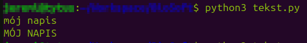
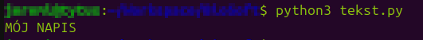

*[Spis treści kursu](<../README.md#spis-treści>)*

# Typy danych I

Kolejny koncept programistyczny, który omówimy to typy danych.
<br/>Wiesz już, [jak przechowywać dane w zmiennych](<./Czym są zmienne.md>), więc czas się dowiedzieć, co konkretnie można w nich przechowywać.

Każda zmienna ma swój typ.
<br/>${\color{lightgray} \tiny \textit{I nie mowa tu o facetach...}}$

Spotkaliśmy się już z dwoma spośród podstawowych typów danych:
- Liczby całkowite (*integer*)
- Tekst (*string*)

Zaczniemy od nich, a następnie przejdziemy do pozostałych typów danych.

## Spis treści
- [Integer](#integer)
- [String](#string)

## Integer
### [🠉](#spis-treści)
Jest to typ danych odpowiadający liczbom całkowitym.
<br/>W Pythonie nazywany jest skrótowo `int`.
<br/>Zmienną typu `int` można stworzyć poprzez przypisanie liczby całkowitej lub za pomocą polecenia `int()`

```py
my_number = 12
second_number = int() # Automatycznie otrzyma wartość 0
```

Na wartościach tego typu można używać *operatorów* matematycznych:
- `+` - dodawanie
- `-` - odejmowanie
- `*` - mnożenie
- `/` - dzielenie
- `//` - dzielenie całkowite (wynik pozbawiony jest części po przecinku, np. `10 / 4` = 2.5, ale `10 // 4` = 2)
- `**` - potęgowanie
- `%` - modulo, czyli reszta z dzielenia (np. `5 / 3` = 1 r.2, zatem `5 % 3` = 2)

Nie ma *operatora*, który umożliwia pierwiastkowanie, ale istnieje na to sprytny sposób:

```py
square_root_of_2 = 2 ** (1/2)
```

Przy okazji użyłem też operatorów otwarcia i zamknięcia nawiasu, których działanie, jak sądzę, jest oczywiste.

> Przypomnienie ze szkoły na wszelki wypadek: ${\sqrt[y]{x} = x^{\frac{1}{y}}}$

## String
### [🠉](#spis-treści)
Typ danych służący do przechowywania tekstu.
<br/>W Pythonie nazywany skrótowo `str`
<br/>Zmienną tego typu można stworzyć poprzez przypisanie tekstu otoczonego cudzysłowem, (pojedynczym lub podwójnym, nie ma to znaczenia - o ile jesteśmy konsekwentni) lub za pomocą polecenia `str()`.

```py
hello = "Cześć!"
empty = str() # Pusty napis
```

Można również stworzyć string wielolinijkowy, o którym wspomniałem już w poprzednim temacie:

```
long = '''Ten tekst
jest trochę zbyt długi,
więc podzieliłem go na
kilka linijek.'''
```

Warto jeszcze zaznaczyć, że dane typu string są *niemutowalne*, czyli niezmienne.
<br/>W praktyce oznacza to, że nie da się ich zmodyfikować - jeśli chcemy np. zmienić jedną literę w jakimś napisie, to musimy cały wyrzucić i zastąpić nowym, ze zmienioną literą.

### Metody
Dane typu string posiadają cały zestaw metod, czyli specjalnych poleceń, które służą głównie do stworzenia nowego tekstu na podstawie tego, na którym używamy polecenia.
<br/>W związku z niemutowalnością danych typu string, musimy pamiętać, żeby po użyciu takiej metody przypisać wynik jej działania do nowej zmiennej (albo tej samej, wyrzucając w ten sposób oryginał).

```py
text = "mój napis"
TEXT = text.upper()

print(text)
print(TEXT)
```

**

Użyłem właśnie metody `upper()`, która na podstawie napisu w zmiennej `text` stworzyła nowy, zapisany wielkimi literami.
<br/>Zauważ, że zmienna `text` nie zmieniła swojej zawartości. Wynik działania metody musiałem zapisać w zmiennej `TEXT`.
<br/>Oczywiście, jeśli nie byłby mi już potrzebny oryginalny napis, mógłbym zrobić tak:

```py
text = "mój napis"
text = text.upper()

print(text)
```

**

Kilka bardziej użytecznych metod, których można użyć na danych typu string znajdziecie poniżej:
- upper() - zmienia wszystkie litery na wielkie
- lower() - zmienia wszystkie litery na małe
- capitalize() - zmienia pierwszą literę na wielką, np. `"ania ma kota".capitalize()` = "Ania ma kota"
- title() - zmienia pierwszą literę **każdego słowa** na wielką, np. `"ania ma kota".title()` = "Ania Ma Kota"
- replace(x, y) - zmienia wszystkie wystąpienia litery/słowa x na y, np. `"ania ma kota".replace('a', '.')` = ".ni. m. kot."
- count(x) - zwraca liczbę wystąpień litery/słowa x, np. `"ania ma kota".count('a')` = 4

Takich metod istnieje znacznie więcej. Po kompletną listę odsyłam do [dokumentacji Pythona](https://docs.python.org/3/library/stdtypes.html#string-methods) - choć na razie pewnie ci się nie przyda.

### Splicing
